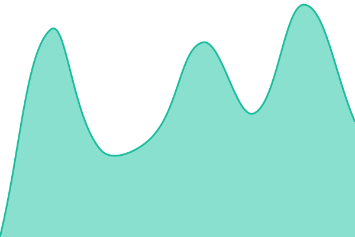
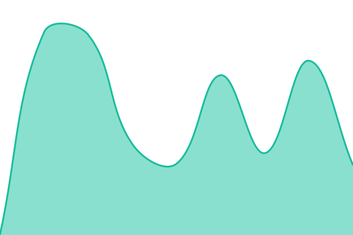

# [📈 Live Status](https://status.springs.solutions): <!--live status--> **🟧 Partial outage**

This repository contains the open-source uptime monitor and status page for [Jeremy Yowell](https://status.springs.solutions), powered by [Upptime](https://github.com/upptime/upptime).

With [Upptime](https://upptime.js.org), you can get your own unlimited and free uptime monitor and status page, powered entirely by a GitHub repository. We use [Issues](https://github.com/JeremyYowell/springs-status/issues) as incident reports, [Actions](https://github.com/JeremyYowell/springs-status/actions) as uptime monitors, and [Pages](https://status.springs.solutions) for the status page.

<!--start: status pages-->
<!-- This summary is generated by Upptime (https://github.com/upptime/upptime) -->
<!-- Do not edit this manually, your changes will be overwritten -->
<!-- prettier-ignore -->
| URL | Status | History | Response Time | Uptime |
| --- | ------ | ------- | ------------- | ------ |
|  [Springs Solutions (Hub)](https://springs.solutions) | 🟩 Up | [springs-solutions-hub.yml](https://github.com/JeremyYowell/springs-status/commits/HEAD/history/springs-solutions-hub.yml) | 

 464ms
     
 | 

<a href="https://status.springs.solutions/history/springs-solutions-hub">99.05%</a>
    

|  [Chore Pets](https://chorepets.springs.solutions) | 🟩 Up | [chore-pets.yml](https://github.com/JeremyYowell/springs-status/commits/HEAD/history/chore-pets.yml) | 

 473ms
     
 | 

<a href="https://status.springs.solutions/history/chore-pets">99.05%</a>
    

|  [Unfold](https://unfold.springs.solutions/app/) | 🟥 Down | [unfold.yml](https://github.com/JeremyYowell/springs-status/commits/HEAD/history/unfold.yml) | 

 319ms
     
 | 

<a href="https://status.springs.solutions/history/unfold">95.01%</a>
    

|  [Footage](https://footage.springs.solutions) | 🟩 Up | [footage.yml](https://github.com/JeremyYowell/springs-status/commits/HEAD/history/footage.yml) | 

 634ms
     
 | 

<a href="https://status.springs.solutions/history/footage">100.00%</a>
    

|  [Reel Coach](https://reelcoach.springs.solutions) | 🟩 Up | [reel-coach.yml](https://github.com/JeremyYowell/springs-status/commits/HEAD/history/reel-coach.yml) | 

 605ms
     
 | 

<a href="https://status.springs.solutions/history/reel-coach">100.00%</a>
    

|  [Video Platform](https://vp.springs.solutions) | 🟩 Up | [video-platform.yml](https://github.com/JeremyYowell/springs-status/commits/HEAD/history/video-platform.yml) | 

 637ms
     
 | 

<a href="https://status.springs.solutions/history/video-platform">100.00%</a>
    

|  [LotGD](https://lotgd.springs.solutions) | 🟩 Up | [lot-gd.yml](https://github.com/JeremyYowell/springs-status/commits/HEAD/history/lot-gd.yml) | 

 443ms
     
 | 

<a href="https://status.springs.solutions/history/lot-gd">99.05%</a>
    

<!--end: status pages-->

[**Visit our status website →**](https://status.springs.solutions)

## 📄 License

- Powered by: [Upptime](https://github.com/upptime/upptime)
- Code: [MIT](./LICENSE) © [Anand Chowdhary](https://anandchowdhary.com)
- Data in the `./history` directory: [Open Database License](https://opendatacommons.org/licenses/odbl/1-0/)
